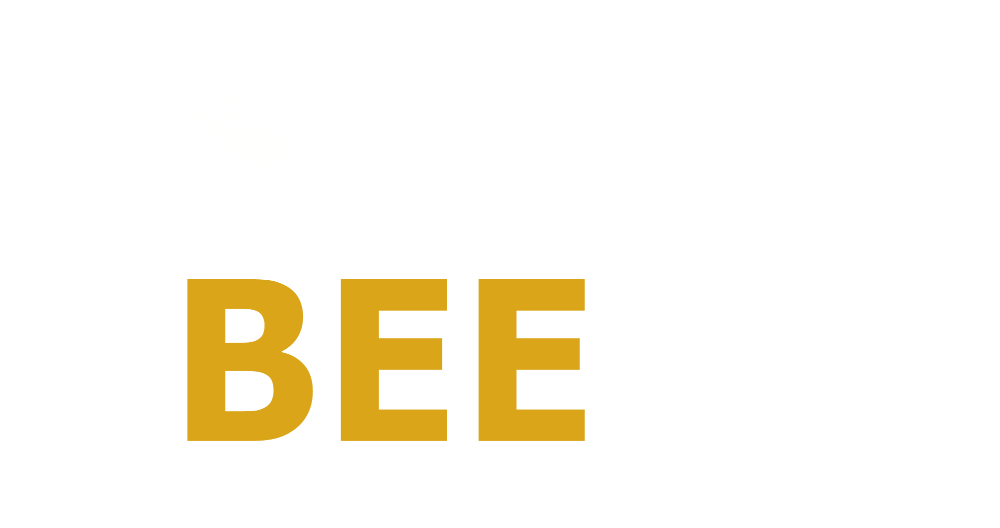
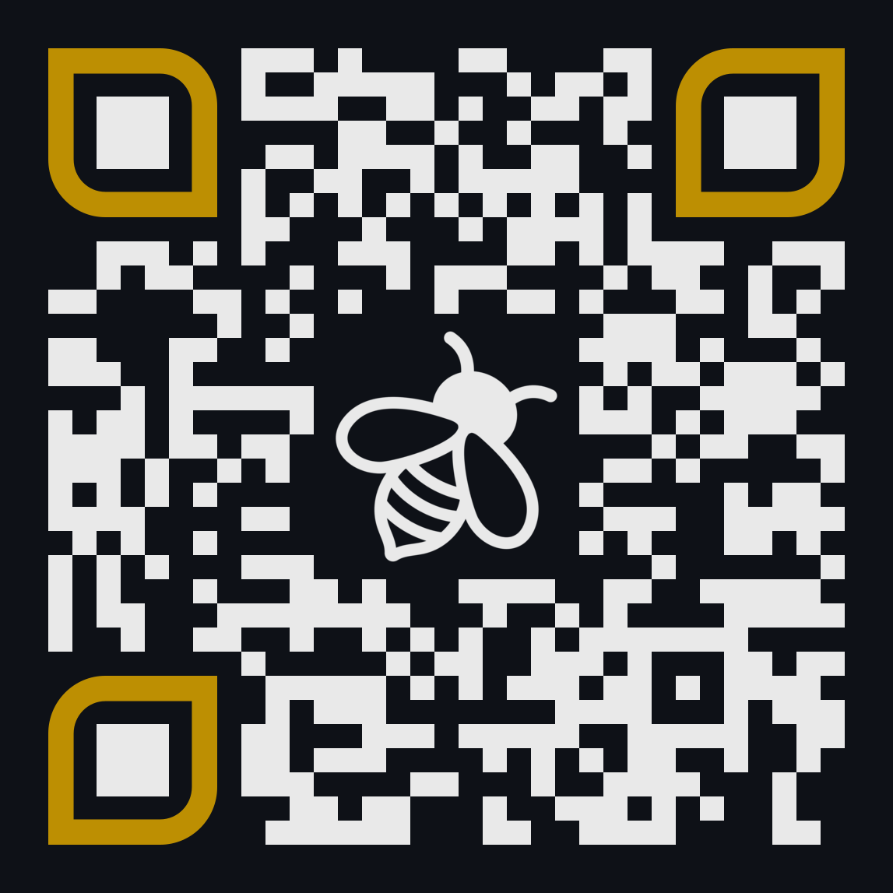

# About 

The **Behavioural and Experimental Economics (BEEcon) Reading Group** meets every two weeks to discuss recent developments in behavioural economics and related fields in a friendly and informal environment. Meetings are held to present research papers or ongoing projects, with emphasis on new concepts, techniques, and experimental strategies. Reading suggestions from participants are welcome.

The 2023-24 reading group is organised by [Austeja Kazemekaytite](mailto:a.kazemekaityte@unitn.it?subject=BEEcon%20Reading%20Group) and [Nicola Campigotto](mailto:nicola.campigotto@unitn.it?subject=BEEcon%20Reading%20Group).

### 📌 *Who can participate?*

Anyone from students to full professors :)

### 📌 *Formula*

Each meeting consists of a 45-minute presentation by a designated speaker, followed by 15 minutes of general discussion. Presentations are interactive and questions and comments from participants are strongly encouraged. If a meeting involves the discussion of a research paper, each participant (not just the presenter!) is expected to read the paper in advance. Presenters are appointed on a voluntary basis.

### 📌 *Time and venue*

`When:` Thursday from 4PM to about 5PM.    
`Where:` Department of Economics and Management, University of Trento, via Vigilio Inama 5, 1st Floor Seminar Room.

Meetings can be live-streamed on request for those unable to attend in person. Any changes to the normal schedule will be announced in advance.

### 📌 Mailing list

Click [HERE](https://groups.google.com/a/unitn.it/g/beecon-reading-group-rnoos72391n9-unverified) or scan the QR code below to join the BEEcon mailing list and receive updates on meetings and other activities.

<picture>
  <source media="(prefers-color-scheme: dark)" srcset="images/qr-code.png" width="200px">
  <source media="(prefers-color-scheme: light)" srcset="images/qr-code.png" width="200px">
  
</picture>

# Upcoming meetings

| 📆 **Meeting date** | 📢 **Presenter**      | 📝 **Topic** |
| :--- | :--- | :--- |
| Oct 5 2023, 4PM      | Nicola Campigotto     | Goette and Tripodi (2023), "[The limits of social recognition: Experimental evidence from blood donors](https://www.egontripodi.com/papers/recognition.pdf)", working paper |
| Oct 19 2023, 4PM     | Austeja Kazemekaytite | TBA |

# Past meetings

Past meetings will be listed here.

