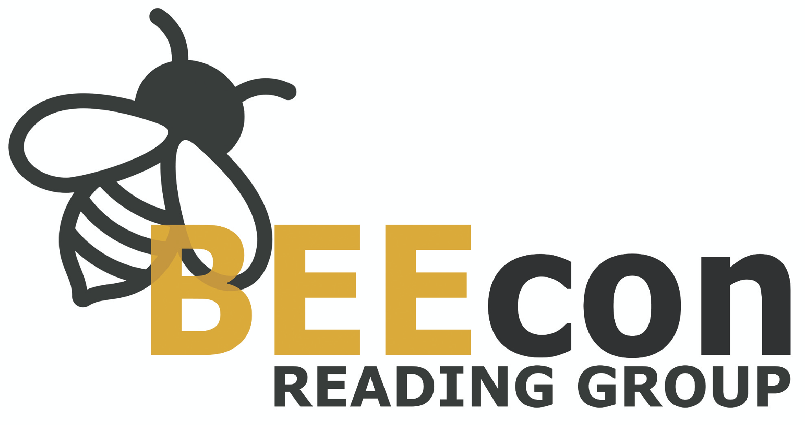

The **Behavioural and Experimental Economics (BEEcon) Reading Group** meets every two weeks to discuss new developments in behavioural economics and related fields in a friendly and informal environment. Meetings may involve the discussion of research papers or ongoing projects by students or faculty members.

The reading group is organised by Austeja Kazemekaytite and Nicola Campigotto. Reading suggestions from participants are welcome.

### Who can participate? 

Anyone from graduate students to full professors :)

### Formula

Each meeting consists of a one-hour presentation by the speaker, followed by a general discussion. The talks are interactive and questions from participants are strongly encouraged. If a meeting involves the discussion of a research paper, each participant (and not just the speaker!) is encouraged to read the paper in advance.

### Time and place

Friday from 16.00 to 17.00. Room X, Department of Economics and Management, University of Trento, via Vigilio Inama 5 (first floor). An overview of the upcoming meetings is given in the table below.

### Mailing list

To receive updates on meetings and other activities, visit this page and join the BEEcon mailing list.

## Upcoming meetings

## Past meetings